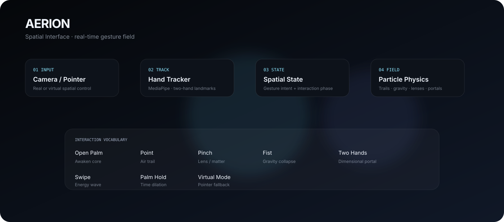

<div align="center">

# ◌ AERION

### **Make space responsive.**

A real-time spatial interface where your hands shape a living field of light, matter, and motion.

<p>
  <a href="https://chillingbing648-sketch.github.io/Aerion/"><strong>ENTER THE EXPERIENCE ↗</strong></a>
  &nbsp; · &nbsp;
  <a href="https://github.com/chillingbing648-sketch/Aerion">Explore the source</a>
</p>

<p>
  
  
  
  
  
  
  
</p>

</div>

---

<p align="center">
  
</p>

<div align="center">
  <sub>CAMERA OR POINTER &nbsp; / &nbsp; GESTURE RECOGNITION &nbsp; / &nbsp; SPATIAL PHYSICS &nbsp; / &nbsp; LIVE CANVAS</sub>
</div>

---

## The idea

**What if a screen behaved less like a page and more like a space?**

AERION explores that question through a full-screen digital field. Move your hand to disturb the particles. Point to draw light through the air. Pinch to gather matter. Bring two hands together to form a portal. The interface reacts continuously, rather than waiting for a sequence of clicks.

There is no conventional dashboard to navigate. A quiet heads-up display stays at the edges while the canvas does the expressive work.

<div align="center">

| **INPUT** | **INTERPRETATION** | **RESPONSE** |
|:---:|:---:|:---:|
| Hand / pointer | Gesture + motion | Matter, light + force |

</div>

## Step inside

### Two ways to explore

**Camera mode** uses MediaPipe Hand Landmarker to track up to two hands in real time. The live, mirrored camera layer becomes part of the atmosphere while your gestures shape the field.

**Virtual Spatial Mode** maps pointer movement and keyboard modifiers onto the same interaction model. No camera permission is needed, making it a practical way to try the experience or explore on a device without a webcam.

### The interaction atlas

| Gesture / input | What it does |
|---|---|
| **Open palm** | Awakens a luminous spatial core and orbital halo. |
| **Point** | Draws and attracts particles into flowing air trails. |
| **Pinch** | Condenses nearby trails into a manipulable object. |
| **Steady pinch** | Can summon the refractive Spatial Lens in open space. |
| **Quick pinch release** | Triggers a Reality Burst that sends matter outward. |
| **Fist** | Pulls surrounding particles into a rotating gravity well. |
| **Palm hold** | Enters a time-dilation interaction state. |
| **Two hands** | Forms a dimensional portal; hand distance shapes its scale. |
| **Swipe** | Sends an energy wave through the field and shifts its palette. |

The in-app **Gestures** guide explains the core vocabulary. The experience is intentionally exploratory: gesture recognition depends on camera visibility, hand position, lighting, and the stability of the tracking environment.

### Virtual controls

| Input | Virtual action |
|---|---|
| Move pointer | Move the simulated hand |
| Pointer down | Pinch-like interaction |
| Hold `Shift` | Simulate a fist / gravity interaction |
| Hold `Alt` | Simulate an open hand and second-hand input |
| `R` or `Space` | Recenter spatial matter |

---

## How the field works

AERION separates the interface shell from the real-time interaction loop. React coordinates the experience and HUD; dedicated TypeScript systems handle tracking, gesture state, particle motion, and canvas rendering.

```text
 CAMERA ──► MediaPipe Hand Landmarker ──► HandTracker ──┐
                                                       │
 POINTER ──► Virtual hand input ───────────────────────┤
                                                       ▼
                                             Spatial State + Bus
                                                       │
                        ┌──────────────────────────────┼─────────────────────┐
                        ▼                              ▼                     ▼
                  Gesture logic                 Particle physics      UX / HUD state
                        └──────────────────────────────┼─────────────────────┘
                                                       ▼
                                              Spatial Renderer
                                                       ▼
                                             Full-screen 2D Canvas
```

### The systems behind the sensation

| System | Responsibility |
|---|---|
| **Gesture engine** | Extracts hand features, interprets poses, smooths motion, and maintains tracked-hand state. |
| **Spatial state + bus** | Coordinates interaction phases, the core, lens, portal, trails, bursts, and shared events. |
| **Particle engine** | Simulates drift, hand-driven forces, gravity, orbital motion, vortices, and burst effects. |
| **Spatial renderer** | Draws the field through Canvas 2D, with layered effects and camera compositing. |
| **Quality engine** | Adjusts particle density according to frame timing and device characteristics. |
| **React UI** | Handles startup, camera permission, virtual mode, contextual status, and the gesture guide. |

The animation loop uses `requestAnimationFrame`. Tracking, simulation, and drawing run outside React's normal render cycle; HUD updates are emitted when meaningful interaction state changes. This keeps rapidly changing spatial data out of the component tree.

## Designed to adapt

AERION starts with different particle budgets based on the detected device context:

| Context | Initial particle budget |
|---|---:|
| Typical desktop | Up to 800 |
| Mobile / coarse pointer | Up to 420 |
| Reduced-motion preference | Up to 280 |

The quality system monitors recent frame duration and can lower or recover particle density over time. Device-pixel ratio is capped, and reduced-motion preferences are passed into the simulation and rendering systems. These are adaptation strategies, not a guarantee of a fixed frame rate on every device.

## The visual language

AERION keeps the interface quiet so the interaction remains the focal point.

- **Spatial matter** — a particle field that shifts between ambient drift and gesture-driven force.
- **Air trails** — luminous paths drawn through point gestures.
- **Spatial Lens** — an optical, refractive surface summoned through sustained interaction.
- **Reality Burst** — a short-range shockwave that pushes nearby matter outward.
- **Gravity Collapse** — a rotating field that draws particles inward.
- **Dimensional Portal** — a two-hand vortex whose scale and energy respond to hand placement.
- **Atmospheric camera layer** — a mirrored video surface, toned to sit behind the spatial rendering.
- **Contextual HUD** — small status, palette, interaction, recenter, and gesture-guide controls.

The intent is not to imitate a science-fiction dashboard. It is to make motion, physical response, and visual feedback feel like one continuous system.

---

## Run it locally

### Prerequisites

- Node.js 22 recommended
- npm
- A current desktop or mobile browser
- Camera access for camera mode; virtual mode works without it

### Install and launch

```bash
git clone https://github.com/chillingbing648-sketch/Aerion.git
cd Aerion
npm ci
npm run dev
```

Open the local URL printed by Vite.

### Verify a production build

```bash
npm run lint
npm run build
npm run preview
```

- `npm run lint` runs TypeScript's no-emit check.
- `npm run build` creates the production bundle in `dist/`.
- `npm run preview` serves that built bundle locally.

## Deployment

AERION is published through GitHub Actions and GitHub Pages.

1. Push a change to `main`, or manually run the deployment workflow.
2. The workflow installs dependencies with `npm ci`.
3. Vite builds the production bundle.
4. The workflow publishes `dist/` to GitHub Pages.

The deployment workflow lives at `.github/workflows/deploy.yml`. Vite is configured with `base: './'` so generated assets can resolve from the repository's Pages path.

<p align="center">
  <a href="https://chillingbing648-sketch.github.io/Aerion/"><strong>Open the live experience ↗</strong></a>
</p>

---

## Camera, model loading & privacy

Camera mode requires explicit browser permission and a secure context; `localhost` is suitable for local development. If a camera is unavailable or permission is denied, use Virtual Spatial Mode instead.

The hand-tracking runtime and model are fetched from external hosts when initialized:

- MediaPipe Tasks Vision WebAssembly assets: jsDelivr
- Hand Landmarker model: Google Cloud Storage

Hand detection runs client-side in the browser. The repository does not define an application backend or a video-upload endpoint for this experience. External asset requests are still required to load the tracking runtime and model.

GPU delegate initialization is attempted first; if it fails, the hand landmarker falls back to CPU. Performance and tracking stability vary with camera quality, lighting, browser support, and device capabilities.

## Project map

```text
AERION/
├── .github/workflows/
│   └── deploy.yml
├── assets/
│   └── aerion-spatial-map.svg
├── src/
│   ├── components/
│   │   ├── AuraVignette.tsx
│   │   ├── CameraLayer.tsx
│   │   ├── GateModal.tsx
│   │   ├── SpatialCanvas.tsx
│   │   └── SpatialHUD.tsx
│   ├── hooks/
│   │   ├── useCamera.ts
│   │   └── useHandTracking.ts
│   ├── systems/
│   │   ├── gesture/
│   │   ├── physics/
│   │   ├── rendering/
│   │   ├── spatial/
│   │   └── QualityEngine.ts
│   ├── App.tsx
│   ├── index.css
│   └── main.tsx
├── index.html
├── package.json
├── package-lock.json
├── tsconfig.json
└── vite.config.ts
```

## Current scope

**Implemented:** camera-based hand tracking, two-hand support, virtual pointer control, gesture smoothing, physics-driven particles, lens and burst effects, gravity interaction, portal behavior, contextual HUD, gesture guide, adaptive quality, reduced-motion awareness, and GitHub Pages deployment.

**Boundaries to know:** this is an interactive spatial experiment, not a conventional productivity app. It does not provide account management, cloud-saved sessions, an application API, or a server-side video-processing service. Hand tracking depends on external model/WASM availability and still benefits from good lighting and a clearly visible hand.

## Troubleshooting

| Issue | Try this |
|---|---|
| Camera option is unavailable | Open the site in a modern browser over HTTPS or use `localhost`; check browser camera permissions. |
| No hand is detected | Improve lighting, keep the hand inside the frame, and avoid hiding fingers behind objects. |
| Model initialization fails | Check connectivity to jsDelivr and Google Cloud Storage, then reload and retry. |
| Performance feels slow | Close GPU-heavy tabs, try a smaller browser window, or switch to Virtual Spatial Mode to isolate camera/model overhead. |
| Camera permission is denied | Update the site's permission in browser settings or continue with virtual controls. |

---

## Design principle

<div align="center">

### **Move through the field. The field responds.**

Motion becomes input. Input becomes force. Force becomes a visible world.

</div>

AERION is an experiment in making a digital interface feel less like something you operate and more like something you can physically influence.

<div align="center">

[**ENTER AERION ↗**](https://chillingbing648-sketch.github.io/Aerion/)  
<sub>Built with React, TypeScript, MediaPipe, and Canvas 2D.</sub>

</div>
